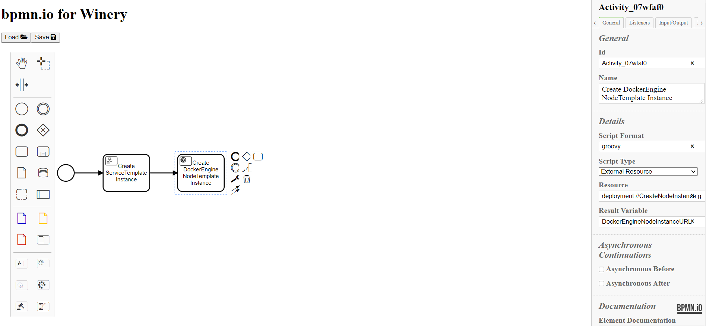
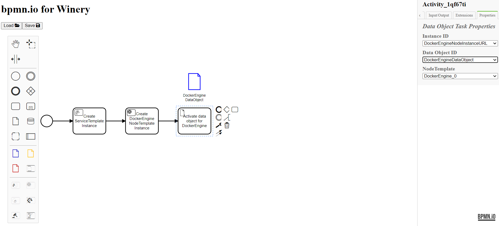
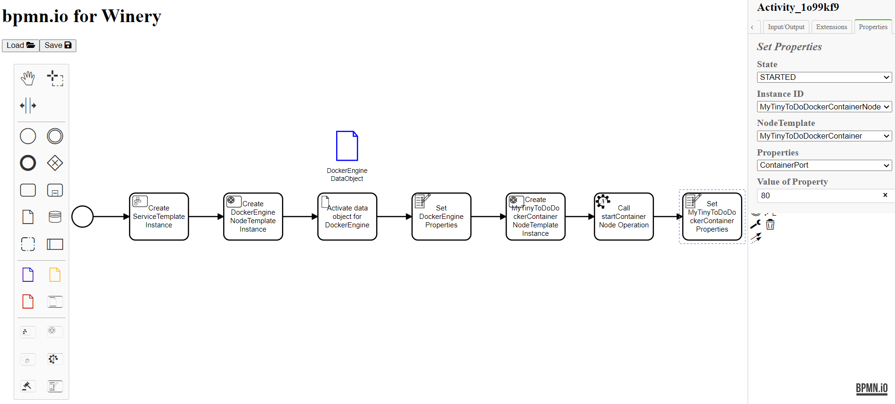

# BPMN Modeler for Winery

## 1)	Motivation
Applications consists of many different components that need to be maintained.  Manual deployment is a problem, because it is error-prone, time-consuming, and costly. On 08.06.2021 an admin configuration of the cloud provider Fastly caused a problem, which lead to 85% of the network returning errors. Consequently, applications like Netflix, Amazon or PayPal were not available for a certain amount of time. Another reason why manual deployment is not sufficient, is the complexity of an application or the requirement for deployment configuration / customization. Therefore, you need experts in this field, which typically causes higher expenses. An approach to prevent this problem is to select a specific deployment system. That on the other hand could lead to a vendor lock-in because most deployment systems differ in their functionalities. This leads to the compromise of using one of the available deployment systems, which matches most of your needs. This solution is insufficient, which is why we need a standard to deploy and manage cloud applications in a portable manner. TOSCA (The Topology and Orchestration Specification for Cloud Applications) is such a standard. It allows the automation of deployment and management of cloud applications in a portable manner. TOSCA also allows the imperative deployment modeling approach, i.e. you can upload a BPEL & BPMN plan to define a management plan. However, the current approach of the BPMN connection is not fully implemented yet. That is why we present a new BPMN modeler for the winery, which allows modelling of (customized) workflows with user-defined behavior. You can use this modeler to define a plan, which gets executed in the OpenTOSCA Runtime. In addition, the modeler is easy to use and to extend, which allows for different ways to create new tasks and integrate them into the project.

## 2) Use Case Bild

Our Use Case is the creation of a MyTinyToDo instance, which is hosted on a Docker Engine (see figure 1). Every component is rendered as a box, each representing a node template. The edge represents a relationship template, which is of the type “hosted-on”.
To deploy a MyTinyToDo instance, we have to deploy from the bottom up, i.e. we need to start a container on the docker engine to run the MyTinyToDo instance.
First, we need to think about the type of input parameters our build plan needs. In order to find the MyTinyToDo instance later, we must define the port on which we will deploy it. We have to specify the dockerengineurl to be able to connect to the dockerengine, on which the mytinytododockercontainer is hosted.
After that, we can start modeling our build plan. First, we create a servicetemplate instance. In the next step we create a dockerengine instance and a mytinytododockercontainer instance. Next, we perform the startContainer operationon on the dockerengine instance. Now we need to realize the hosted-on relationship by creating a relationshiptemplate instance, where the sourceurl is the mytinytododockercontainer instance url and the targeturl is the dockerengine instance url. After the successful execution of the plan, we can find the MyTinyToDo instance on http://localhost:Port.

## 3) Concept

The basic idea is to extend the bpmn io modeler with bpmn4tosca tasks^1. In contrast to the Reference, we provide seven new tasks and three types of data objects which we describe later in this section. They allow modeling plans with the capability of calling the management operations of TOSCA components and creating instances. In order to deploy the plan in the UI, we connect the Modeler with the Winery frontend. This saves the plans in the backend of Winery. By pressing install in the OpenTOSCA UI, the plan gets deployed inside the container. Starting a plan leads to the plan getting executed by the Camunda Engine.

### 3.1 Extension of the script task

All seven tasks are an extension of the BPMN script task. Each of them contains a reference to a predefined groovy script (see link), which is performed later on the corresponding node.

#### 3.1.1 Create servicetemplate instance task
-Parameters: `State` (optional)
-Result variable: `ServiceInstanceURL`

This task generates a servicetemplate instance and allows setting the state of the servicetemplate instance, if the creation of that instance was successful.

#### 3.1.2 Create nodetemplate instance task 
-Parameters: `State` (optional), `NodeTemplate`
-Result variable: `NodeInstanceURL`

This task generates a nodetemplate instance based on the selected nodetemplate. It allows setting the state of the instance, if the creation of that instance was successful.

#### 3.1.3 Create relationship instance task
-Parameters: `State` (optional), `RelationshipTemplate`, `SourceURL`, `TargetURL`
-Result variable: `RelationshipInstanceURL`

This task generates a relationshiptemplate instance based on the selected relationshiptemplate and connects the user-defined sourceurl and targeturl. In addition, it allows setting the state of the servicetemplate instance, if the creation of that instance was successful.

#### 3.1.4 data object task 
-Parameters: `InstanceID`, `DataObjectID`, `NodeTemplate`

The purpose of this task is to make the camunda engine aware of the data objects. Currently data objects are “invisible” to the engine and only used for the modeling process. This task maps the dataobject to a defined instance to edit/access properties.

#### 3.1.5 call node operation task
-Parameters: `ServiceInstanceURL`, `NodeTemplate`, `Interface`, `Operation`, `InputParameters`, `Name of Parameter`, `Type of Parameter` (DA, String or VALUE of data object), `OutputParameters`

The call node operation task executes a management operation based on the parameters of the selected nodetemplate.
An input parameter is either of type string, type VALUE or type DA. If the type string is selected, an extra textfield appears, where the value of the parameters must be specified.
If the type VALUE is selected, a list of the currently available data objects ids is visible. After choosing an id, the data object property gets selected. The property whose value should be assigned to the input parameter needs to be chosen next.
If the type DA is selected, a list of all Deployment Artifacts, which were specified in the xml in the winery, becomes visible.

#### 3.1.6 set properties task
-Parameters: `State` (optional), `InstanceURL`, `NodeTemplate`, `Properties`, `Value of Property`

This task allows editing properties of an instance but be aware that it can change the properties inside the data object.

#### 3.1.7 set state task
-Parameters: `State`, `InstanceURL`

This task allows setting the state of the instance, which is specified in the parameter InstanceURL, if you dont want to set the state at the point of creation or if you want to explicitly model the state.

### 3.2 Extensions of the data object
(Bild)
The purpose of these constructs is to provide an overview of the properties of a selected node instance and to provide access to these properties in different tasks. During runtime, the properties may change and that should affect the information reflected in the data object. To use these data objects, a data object task in the workflow needs to be integrated. If this is not the case, the camunda engine will completely ignore the data object.

## 4) Example usage
First of all, we start with a start event. On the left side you see the Palette of the Modeler which is extended by our symbols and that are explained in the earlier sections. On the right side you can see the PropertiesPanel which we extended by a new tab the so-called Properties tab which you will see later on. 

### 0. Step: Create a ServiceTemplate instance

As explained in section reference the service template instance task creates a service template and allows to optionally directly set the state. In order to reduce the workflow, we set the state of the successful created servicetemplate instance to CREATING. 

### 1. Step: Create a DockerEngine instance

In the next step we change the name of the result variable to DockerEngineNodeInstanceURL. The default value is of the result variable is a combination of the id and the String ‘NodeInstanceURL’, since each id of an element is unique, we can guarantee that each resultvariable is unique.
We model now the creation of a DockerEngine instance, and we set the state to STARTED. This will work if the instance is successfully created.

### 2. Step: Create data object for DockerEngine instance

Data objects are ignored by the process engine. They are important if you want to use properties of the node instance in multiple tasks (for example in a call node operation task). We change the id (and the name) of the data object to MyTinyToDoDataObject. This step is only for reasons of clarify.

In a data object we specify that this data object is mapped to a certain node instance id in order to address its values later. The values of the properties are read-only and the values correspond to the xml in the Winery. For example, we specified in the XML that the value of the DockerEngineURL is given by the input of the user.

### 3. Step: Create data object for DockerEngine instance
Data object tasks allow that data objects are not ignored by the process engine because internally we connect the node instance with the data object. Internally we created for each property of the node template a variable `NodeInstanceURLProperty`.

### 4. Step: Set DockerEngine instance properties

Because we already set the state of the created DockerEngine instance in the last step we leave the optional state in the set properties task empty. To configure the DockerEngine instance correctly we need to set its properties. In this case we need to say that the value of the DockerEngineURL is ${DockerEngineURL}. In camunda this is the way to dynamic set and get process variables. In our case the value of ${DockerEngineURL} is the input which we are given by the user in the UI.

### 5. Step: Create a MyTinyToDoDockerContainer instance

Now we change the name of the result variable to MyTinyToDoNodeInstanceURL. Again, this is only necessary to directly recognize which variable is now created. 
We model now the creation of a MyTinyToDoDockerContainer instance, and we set the state to STARTING. This will work if the instance is successfully created. 

### 6. Step: Call the startContainer operation of the DockerEngine

The call node operation task allows three different types of parameters. If you specify that the type of the parameter is VALUE you need to select input in the value of parameter field. In this case we specify that the input parameter of the startContainer operation has the value ${DockerEngineURL}.
The second possibility is to set the type of the parameter to VALUE. Now we have to specify from which dataobject we need to get which property. In this case we set the ContainerPorts value to the Port value of the MyTinyToDoDataObject. The last possibility is to set the type of the parameter to DA (Deployment Artifact).  You will get a list of all Deployment Artifacts which are specified in the XML in the Winery.

### 7. Step: Set MyTinyToDoDockerContainer instance properties

First of all, we are setting the state of the MyTinyToDoDockerContainer instance to STARTED.
Now we set the value of the ContainerPort property to 80.
Then we are setting the properties of the MyTinyToDoDockerContainer instance. Remember that if we changed the properties of the instance before the node operation, the new value would be loaded in the node operation task. 

### 8. Step: Create HostedOn instance

Now are creating a “hosted on”-relationship instance between the source MyTinyToDoDockerContainerInstanceURL and the target DockerEngineURL.

### 9. Step: Set ServiceTemplate instance state

Now we can set the state of the ServiceInstanceURL to STARTED.

### 10. Step: The whole workflow

This is a complete workflow which specify the build plan of the CSAR MyTinyToDo_Bare_Docker_BPMN.

