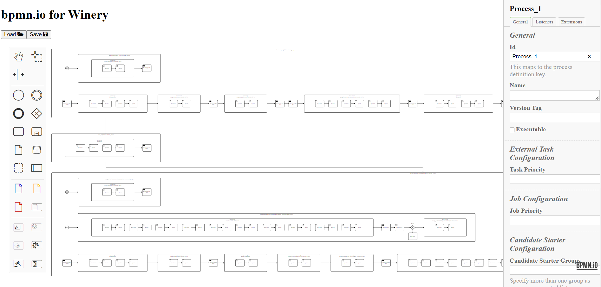

# Setup the connection

1) Navigate in the [Winery](https://github.com/OpenTOSCA/winery) to the Administration tab and select Configuration (if locally started it should be http://localhost:8080/#/admin/configuration)
2) Save the corresponding URL (in our case it's http://localhost:4242 but feel free to change it)

# How to use it
a) If you want to model a new BPMN plan
    1) Create a new BPMN plan in the Winery
    
    2) Click on the `edit` button
    
    3) Start modeling and don't forget to save it :)

An example of an use case is shown in .

b) If you want to access already modeled BPMN plans
   1) Select a BPMN plan in the Winery
   2) Click on the `edit` button
    
   3) Press the `load` button of the opened BOWIE window.
   

c) If you want to see a BPMN visualization of BPEL plans
    1) Select a BPEL plan
    2) Click on the `edit` button
    
    3) The modeler shows now the BPMN visualization of the BPEL plan.
    

    